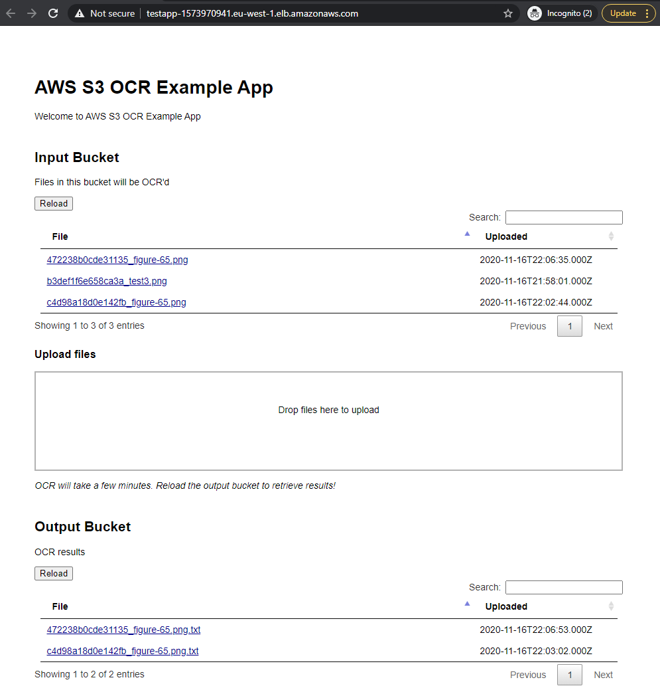

# aws-ocr-s3-frontend

This is a demo web application for an [example OCR service project](https://github.com/bpauwels/ocr-sqs-s3-ecs-cloudformation) running on on AWS using ECS, SQS and S3.
The application is capable of uploading files to a S3 bucket (input bucket) and downloading files from another S3 bucket (output bucket) by creating signed URLs.

It is built on NodeJS using Express.JS, pug templates, JQuery with Datatables, and Dropzone.JS

